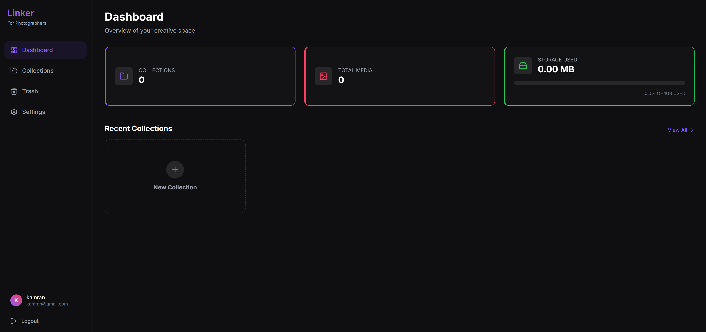
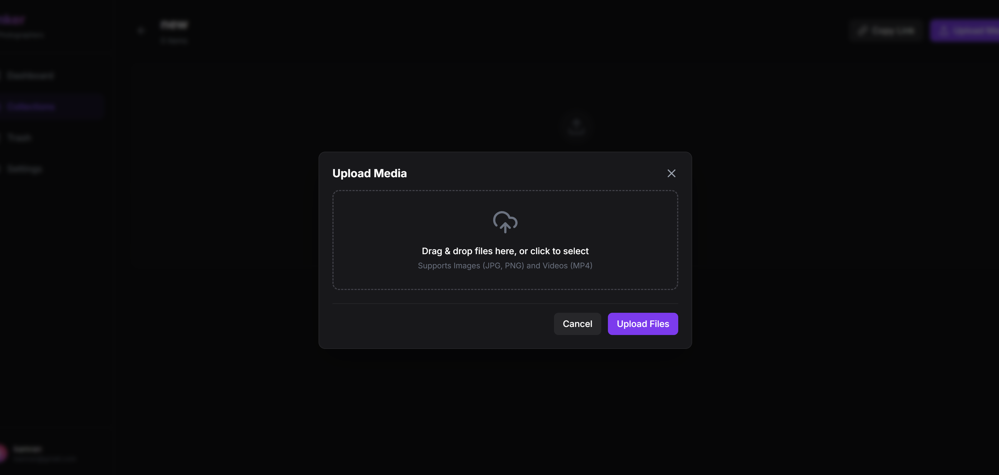
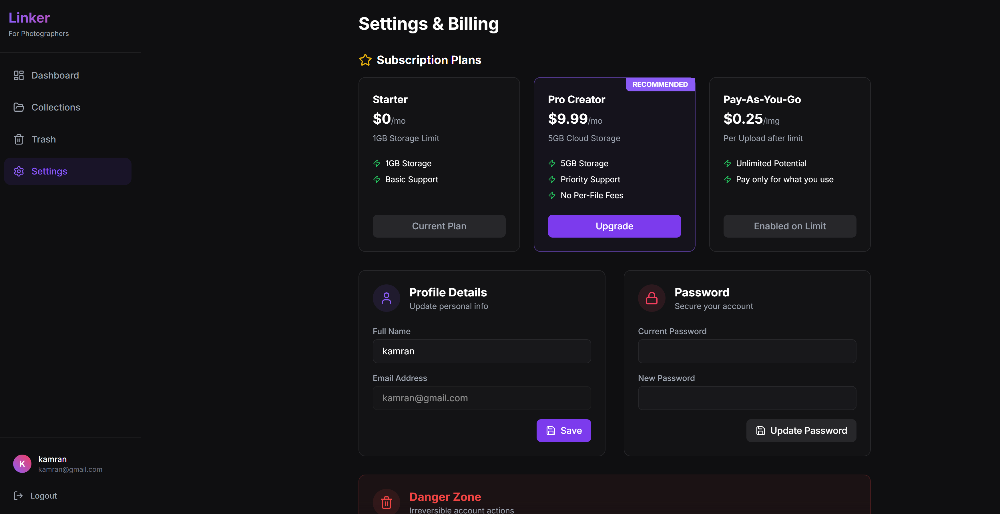
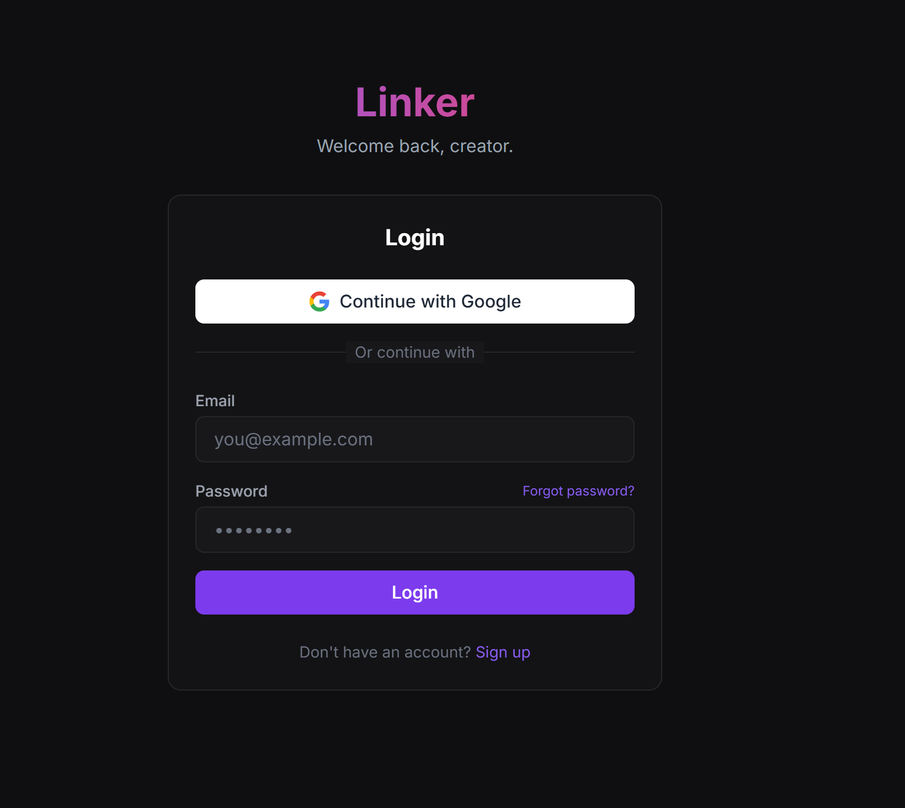

# 📸 Linker - Premium Media Sharing Platform

A production-ready, full-stack MERN web application designed for photographers and content creators to share curated photo and video collections via private, secure links. Think Google Drive, but optimized for visual storytelling.



## ✨ Features

### 🔐 Authentication & Security
- **Secure User Authentication** with JWT (Access + Refresh tokens)
- Email-based password reset
- Protected routes and token-based access control
- Rate-limited uploads for security
- Hashed password storage

### 📁 Smart Category System
- Create unlimited categories for different projects or events
- Each category generates a **unique shareable link**
- Rename, delete, and manage categories effortlessly
- View category statistics (file count, creation date)



### 📤 Powerful Upload System
- **Drag & drop** file uploads
- Upload progress indicators
- Support for images and videos
- Cloudinary-powered media storage
- Metadata tracking (file name, type, size, upload date)

### 🖼️ Media Management
- Masonry grid layout for beautiful photo displays
- Large media previews in modal view
- Rename and delete files
- Sort by date or file type
- Video playback support
- Access complete upload history



### 🔗 Shareable Links (Core Feature)
- **One-click link generation** for any category
- No login required for viewers
- View-only access for shared links
- Download enabled for recipients
- Isolated access (no visibility to other categories)
- Perfect for client reviews or team collaboration



### 🎨 Premium UI/UX
- Modern dark theme with soft gradients
- Glassmorphism card effects
- Smooth micro-interactions with Framer Motion
- Sidebar dashboard layout
- Responsive design for all devices
- Skeleton loaders and empty states
- Hover effects and animations
- Photography-focused aesthetic

## 🛠️ Tech Stack

### Frontend
- **React** with Vite for blazing-fast development
- **Tailwind CSS** for utility-first styling
- **Framer Motion** for smooth animations
- React Context / Redux Toolkit for state management

### Backend
- **Node.js** + **Express** for robust API
- **MongoDB** + **Mongoose** for data persistence
- **JWT** for secure authentication
- **Cloudinary** for scalable media storage

### Security
- Token-based authentication
- Protected API routes
- Secure file handling
- Rate limiting

## 📦 Project Structure

```
Linker/
├── client/                 # React frontend
│   ├── src/
│   │   ├── components/     # Reusable UI components
│   │   ├── pages/          # Page components
│   │   ├── context/        # State management
│   │   ├── utils/          # Helper functions
│   │   └── App.jsx         # Main app component
│   ├── public/
│   └── package.json
│
├── server/                 # Node.js backend
│   ├── models/             # MongoDB schemas
│   │   ├── User.js
│   │   ├── Category.js
│   │   └── Media.js
│   ├── routes/             # API endpoints
│   │   ├── auth.js
│   │   ├── categories.js
│   │   ├── media.js
│   │   └── public.js
│   ├── middleware/         # Auth & validation
│   ├── config/             # Configuration files
│   └── server.js           # Entry point
│
└── README.md
```

## 🚀 Getting Started

### Prerequisites
- Node.js (v16 or higher)
- MongoDB (local or Atlas)
- Cloudinary account

### Installation

1. **Clone the repository**
   ```bash
   git clone https://github.com/mohakamran/Linker.git
   cd Linker
   ```

2. **Install server dependencies**
   ```bash
   cd server
   npm install
   ```

3. **Install client dependencies**
   ```bash
   cd ../client
   npm install
   ```

4. **Set up environment variables**

   Create a `.env` file in the `server` directory:
   ```env
   # Server Configuration
   PORT=5000
   NODE_ENV=development

   # MongoDB
   MONGO_URI=your_mongodb_connection_string

   # JWT
   JWT_SECRET=your_jwt_secret_key
   JWT_EXPIRE=7d
   JWT_REFRESH_SECRET=your_refresh_token_secret
   JWT_REFRESH_EXPIRE=30d

   # Cloudinary
   CLOUDINARY_CLOUD_NAME=your_cloud_name
   CLOUDINARY_API_KEY=your_api_key
   CLOUDINARY_API_SECRET=your_api_secret

   # Email (for password reset)
   EMAIL_SERVICE=gmail
   EMAIL_USER=your_email@gmail.com
   EMAIL_PASSWORD=your_email_password
   ```

   Create a `.env` file in the `client` directory:
   ```env
   VITE_API_URL=http://localhost:5000/api
   ```

5. **Run the application**

   **Start the server:**
   ```bash
   cd server
   npm run dev
   ```

   **Start the client:**
   ```bash
   cd client
   npm run dev
   ```

6. **Open your browser**
   Navigate to `http://localhost:5173`

## 📡 API Documentation

### Authentication Routes
```
POST   /api/auth/register        # Create new account
POST   /api/auth/login           # Login user
POST   /api/auth/forgot-password # Request password reset
POST   /api/auth/reset-password  # Reset password with token
```

### Category Routes (Protected)
```
POST   /api/categories           # Create new category
GET    /api/categories           # Get all user categories
PUT    /api/categories/:id       # Rename category
DELETE /api/categories/:id       # Delete category
```

### Media Routes (Protected)
```
POST   /api/media/upload         # Upload files to category
GET    /api/media/:categoryId    # Get all files in category
PUT    /api/media/:id            # Rename file
DELETE /api/media/:id            # Delete file
```

### Public Routes
```
GET    /api/share/:shareId       # View shared category (no auth required)
```

## 🗄️ Database Models

### User Model
```javascript
{
  name: String,
  email: String (unique),
  password: String (hashed),
  createdAt: Date
}
```

### Category Model
```javascript
{
  userId: ObjectId,
  name: String,
  shareId: String (unique),
  createdAt: Date
}
```

### Media Model
```javascript
{
  categoryId: ObjectId,
  userId: ObjectId,
  type: String (image/video),
  url: String,
  publicId: String,
  name: String,
  size: Number,
  createdAt: Date
}
```

## 🎯 Key Features Breakdown

### Category-First Approach
Users must create a category before uploading any files. This ensures organized content management and makes sharing specific collections intuitive.

### Shareable Links
Every category automatically generates a unique shareable link. Recipients can view and download content without creating an account, making it perfect for:
- Client presentations
- Event photo sharing
- Team collaboration
- Portfolio showcases

### Security & Privacy
- Only the category owner can modify or delete content
- Public links provide view-only access
- No cross-category visibility through shared links
- JWT-based authentication for all protected routes

## 🎨 Design Philosophy

Linker embraces a **premium, photography-focused aesthetic** with:
- Dark theme to emphasize visual content
- Glassmorphism for modern, elegant UI
- Micro-interactions for delightful user experience
- Responsive design that works beautifully on all devices

## 🔧 Development

### Available Scripts

**Client:**
```bash
npm run dev          # Start development server
npm run build        # Build for production
npm run preview      # Preview production build
```

**Server:**
```bash
npm run dev          # Start with nodemon
npm start            # Start production server
```

## 🚀 Deployment

### Frontend (Vercel/Netlify)
1. Build the client: `npm run build`
2. Deploy the `dist` folder
3. Update environment variables with production API URL

### Backend (Heroku/Railway/Render)
1. Push code to repository
2. Configure environment variables
3. Deploy from GitHub/GitLab

### Database (MongoDB Atlas)
Use MongoDB Atlas for production database with proper access controls and backups.

## 🤝 Contributing

Contributions are welcome! Please follow these steps:

1. Fork the repository
2. Create a feature branch (`git checkout -b feature/AmazingFeature`)
3. Commit your changes (`git commit -m 'Add some AmazingFeature'`)
4. Push to the branch (`git push origin feature/AmazingFeature`)
5. Open a Pull Request
